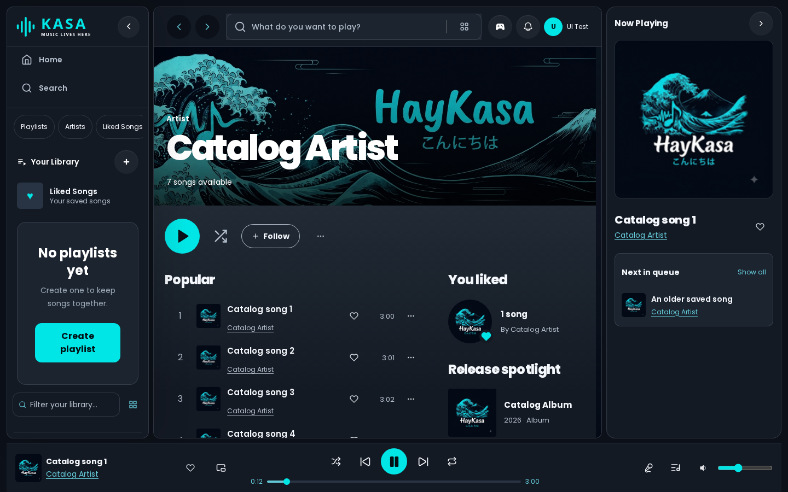
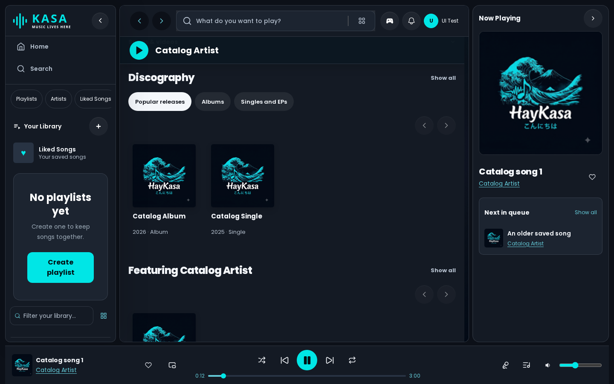
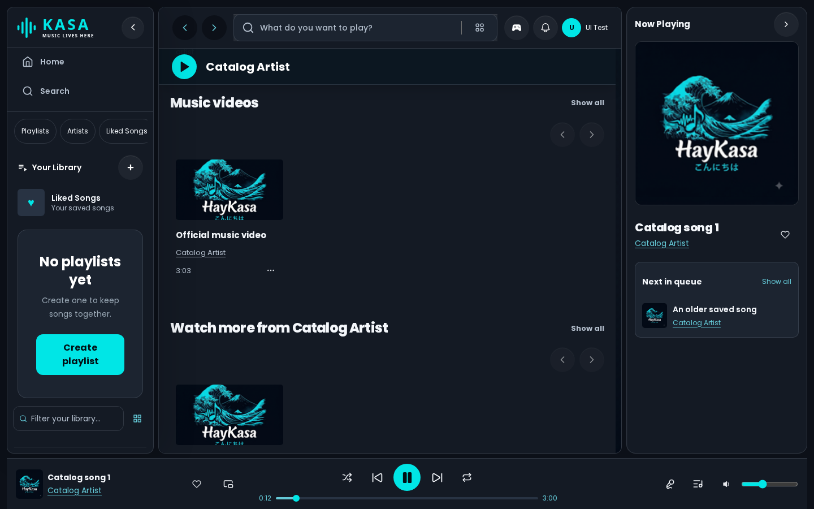
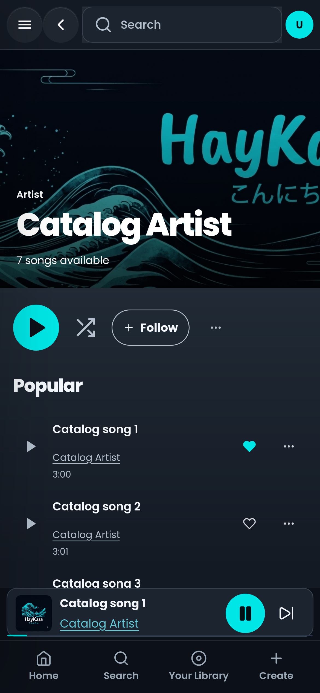
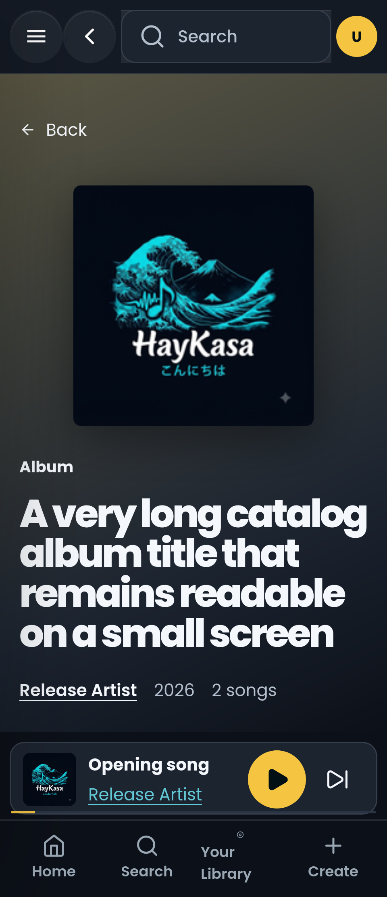

# Spotify-style artist channels

Verified on 2026-10-08 in the isolated cloud checkout, based on PR24 commit `6baae5e472bf5accb37edc8d359e9e20e9b71d50`.

Artist pages now have a full-width banner, compact sticky playback controls, Popular songs, the account’s liked songs, filterable Discography, a release spotlight, Featuring playlists, Music videos, Watch more, related artists and About. Album cards open playable release details. Play, shuffle, release and liked-song actions use the existing collection queue and persistent player.

Music metadata is fetched using the exact artist channel and release browse IDs. Popular songs and release classifications come from provider shelves. Other artists’ comment-linked videos remain under More to explore. Listener counts, verification and artist picks are not invented. The release spotlight uses available release years without claiming an exact latest release date.

## Validation

- `npm run check`: 742 unit tests passed; lint, route type generation, TypeScript and production build passed.
- Artist catalog, release, profile, navigation and PR24 browser suites: 147 passed, 3 expected desktop skips for the mobile player-sheet scenario, no failures or flaky tests. Chrome, Firefox and Safari desktop, Android Chrome and iPhone Safari all passed their applicable cases.
- Coverage includes exact artist credits, uploader/artist differences in liked songs, account switching during pending library reads, follow failures and retries, collection playback, separate release navigation/play controls, pagination, queue continuity, sticky controls, keyboard menus, reduced motion, custom accent, 320px screens and landscape layouts.
- Provider tests cover actual youtubei.js 18 parsed header/shelf shapes, genuine album tracks, no-key playlist metadata, invalid IDs, uncached errors, cache coalescing and bounded admission retained after timeouts. Read-only reviews found the timeout admission defect; its reproduction now keeps one provider call across retries and allows a fresh read after settlement.
- `npm run benchmark:production` and `node scripts/performance-budget.mjs` passed, with no budget regressions across 20 isolated production navigation samples. Build ID: `4M2z_PDc68jWuc0HUs3To`. The report records the PR24 base commit and the uncommitted feature working tree; it does not represent live provider performance.
- An additional Chromium run passed while capturing the catalog sections below the initial viewport.

Browser tests isolate remote catalog responses and the YouTube player while exercising the real application, router, account changes and playback state. Screenshots use deterministic catalog fixtures and HayKasa artwork. They do not establish live catalog delivery, live playback or physical-device behavior.

Live validation remains pending on a configured preview. The local production server has no MongoDB configuration for its existing persistent rate limits, so live API requests return an uncached configuration error before reaching the catalog. A separate direct YouTube Music probe could not connect and reached its 8-second deadline. Production security configuration was retained.

## Screenshots

