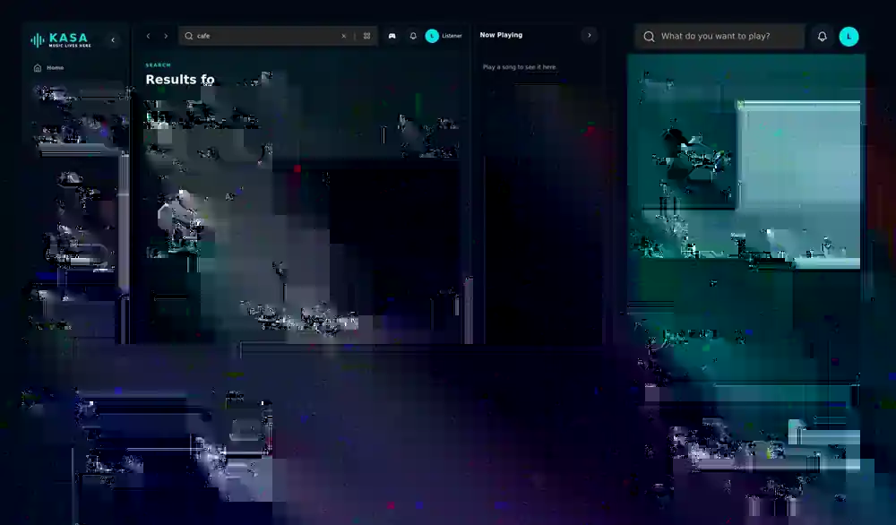
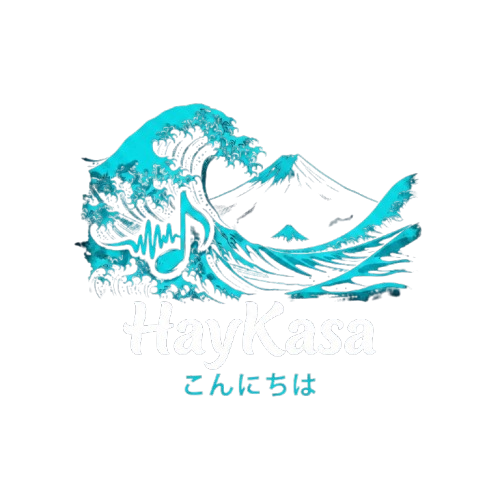

<div align="center">
  

  # HayKasa

  **A responsive music discovery, queue, playlist, and playback experience for web and Windows.**

  [](./package.json)
  [](./package.json)
  [](./desktop/README.md)
  [](https://github.com/6NCLegend9/Spotify-clone/actions/workflows/ci.yml)

  [Open HayKasa](https://haykasa.vercel.app) · [Windows releases](https://github.com/6NCLegend9/Spotify-clone/releases) · [Production notes](./PRODUCTION.md) · [Desktop architecture](./desktop/README.md)
</div>

---

HayKasa combines a Next.js music application with YouTube-backed discovery/playback, personal libraries, queue controls, account-aware recommendations, synchronized lyrics/captions, Jam sessions, and a hardened Windows desktop shell.

## Product views

These product captures are generated from the repository's Playwright browser suite, so they represent the UI exercised by CI rather than mock marketing screens.

<div align="center">
  
</div>

## What HayKasa includes

- **Search and discovery** — song, artist, and playlist discovery with filters, pagination, deduplication, recommendations, and account-aware listening signals.
- **Queue-first playback** — play next, append, reorder/remove, queue persistence, recovery from provider failures, repeat/shuffle controls, and a responsive expanded player.
- **Library tools** — liked songs, user playlists, collaborators, public/private access controls, listening history, followed artists, and playlist browsing.
- **Lyrics and captions** — synchronized lyric/caption surfaces tied to the active player.
- **HayKasa Jam** — signed realtime session events, host/guest roles, shared playback state, AUX controls, persistent rooms, and QR/link sharing.
- **Responsive UI** — desktop multi-panel shell, mobile tab navigation, bottom player, expanded media, keyboard/media-session controls, reduced-motion support, and accessibility settings.
- **Windows desktop** — sandboxed Electron shell, system-browser auth, Discord Desktop IPC, tray/startup controls, appearance profiles, diagnostics, safe mode, and signed native updates.

## Architecture

```text
Browser / PWA
    |
    v
Next.js 15 App Router on Vercel
    |
    +--> API routes / auth / recommendation services
    |        |
    |        +--> MongoDB / Mongoose
    |        +--> YouTube APIs
    |        +--> Supabase Realtime for Jam transport
    |
    +--> Redux client state + player controllers
             |
             +--> YouTube playback / local media surfaces

Windows Desktop
    |
    +--> hardened Electron main + preload boundary
    |
    +--> loads https://haykasa.vercel.app
    |
    +--> /api/desktop/manifest + /api/desktop/update/*
              |
              +--> validated public GitHub Release assets
```

The web application remains the primary product. Electron is a constrained native capability layer rather than a second copy of the frontend/backend.

## Windows desktop and updates

Already-installed desktop builds use stable HayKasa compatibility endpoints:

```text
HayKasa Desktop
  -> https://haykasa.vercel.app/api/desktop/manifest
  -> https://haykasa.vercel.app/api/desktop/update/<channel>/latest.yml
  -> public GitHub Release assets
  -> electron-updater
  -> Windows Authenticode verification
```

That indirection lets existing clients receive a new native release even when the artifact origin changes. Stable/beta releases are versioned GitHub Releases with a complete updater bundle (`latest.yml`, versioned installer, blockmap, and authenticated release manifest). The server fails closed when a bundle is incomplete or its signed manifest does not match the public release assets.

See [desktop/README.md](./desktop/README.md) for the native security boundary, release channels, signing model, staged rollout, and operational controls.

## Tech stack

| Layer | Main technologies |
| --- | --- |
| Web | Next.js 15, React 18, Tailwind CSS, Framer Motion |
| Client state | Redux Toolkit, Redux Persist |
| Auth | NextAuth, bcrypt, Google OAuth |
| Data | MongoDB, Mongoose |
| Playback/discovery | YouTube APIs / `youtubei.js`, browser media APIs |
| Realtime | Supabase Realtime with server-signed Jam events |
| Desktop | Electron, electron-builder, electron-updater |
| Testing | Node test runner, Playwright, ESLint, TypeScript |
| Deployment | Vercel + GitHub Actions + GitHub Releases |

## Requirements

- Node.js **22.x**
- npm
- MongoDB
- SMTP credentials for account email flows
- optional credentials for Google sign-in, YouTube, Supabase Jam, and other integrations described in `.env.example`

Windows desktop development additionally requires the normal Electron/electron-builder platform prerequisites. Stable/beta publication requires the protected signing secrets documented in [desktop/README.md](./desktop/README.md).

## Local development

Clone the repository and install the locked dependencies:

```sh
git clone https://github.com/6NCLegend9/Spotify-clone.git
cd Spotify-clone
npm ci
```

Copy the environment template:

```sh
cp .env.example .env.local
```

For local auth, keep the app and NextAuth on the same loopback origin:

```dotenv
NEXTAUTH_URL=http://localhost:3000
NEXT_PUBLIC_APP_URL=http://localhost:3000
```

Start the web app:

```sh
npm run dev
```

Open `http://localhost:3000`.

### Desktop development

With the web dev server available:

```powershell
cd desktop
npm install
$env:HEYKASA_DESKTOP_URL="http://localhost:3000"
npm start
```

Native tests:

```powershell
npm test
```

## Verification

Run the complete repository gate:

```sh
npm run check
```

That executes unit/contract tests, ESLint, Next.js-generated type checks, TypeScript validation, and a production Next.js build.

Run browser tests after installing Playwright browsers:

```sh
npx playwright install chromium firefox webkit
npm run test:e2e
```

The CI matrix covers Chromium, Firefox, WebKit, mobile Chrome/Safari projects, production dependency auditing, and performance checks. Desktop CI separately tests the web/native contract, native Electron code, dependency audit, and Windows packaging.

## Production and release operations

Production configuration, deployment validation, caching, service-worker behavior, and operational checks are documented in [PRODUCTION.md](./PRODUCTION.md).

Native desktop publication is manual and channel-aware:

- **stable** — signed, non-prerelease, `desktop-vX.Y.Z`, main branch only
- **beta** — signed GitHub prerelease, `desktop-beta-vX.Y.Z[-suffix]`
- **internal** — unsigned GitHub prerelease for testing, `desktop-internal-vX.Y.Z[-suffix]`

The stable/beta workflow verifies the Windows Authenticode signature before a public GitHub Release is created and verifies the published updater assets after release.

## Security principles

HayKasa's security-sensitive paths are designed to fail closed:

- stale/revoked account sessions are rejected before private reads or writes;
- password-reset tokens are one-time and revoke previous sessions;
- playlist access and collaboration are authorization-checked server-side;
- Jam realtime commands are server-authorized, signed, replay-protected, and role-scoped;
- the Electron renderer is sandboxed and receives only a narrow preload API;
- stable/beta desktop releases require both authenticated release metadata and valid Windows code signing;
- native updater, policy, Discord, and diagnostics failures are isolated from normal music playback.

For deeper operational detail, see [desktop/README.md](./desktop/README.md), [PRODUCTION.md](./PRODUCTION.md), and the focused documents under [`docs/`](./docs/).

---

<div align="center">
  
  <br />
  <strong>HayKasa — music lives here.</strong>
</div>
